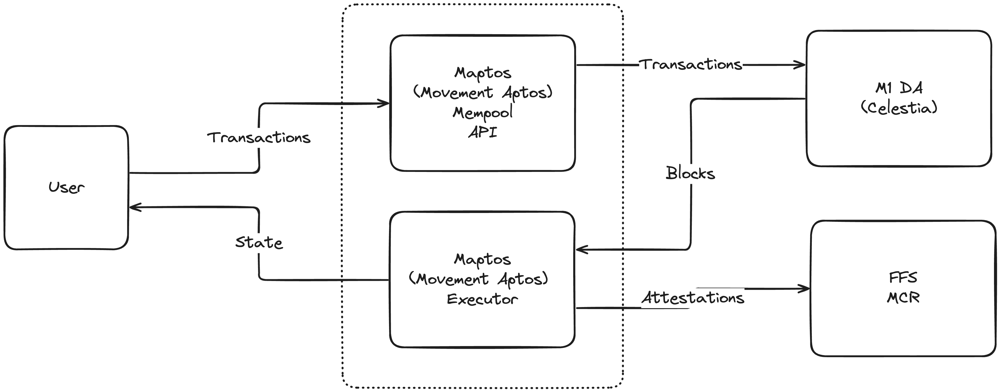

# High-level architecture

## Data Availability

Celestia is used as the Data Availability (DA) layer.

## Sequencing

The M1 DA mempool provides basic fairness sequencing for transactions ingressed to a single node
and then uses the underlying DA to sequence the fair blocks proposed by authorized nodes.

!!! TODO link to relevant node-section in the network-level architecture

## Settlement

The network uses the [Fast Finality Settlement Module](../Introduction/technical_details.md#fast-finality-settlement-module) for transaction finality.

Initially - with the training wheels in place - a specialized node is responsible for updating the state on L1. [Validator nodes](./node_level_architecture.md#validator-node) check against the recorded state root on L1 to increase their security and reduce the risk of providing wrong state updates to users.

As the training wheels get removed the network will move to a more decentralized model where validators will be able to attest to the correctness of state transitions, and a supermajority of validators will be required to advance the state roots on L1.

## Bridge

!!! TODO How does the bridge work? 

!!! What is being bridged?

!!! By whom?

!!! Links to documentation?

!!! A diagram or a flowchart?

!!! TODO link to relevant node-section in the network-level architecture

## User interaction

!!! TODO How do users interact with the network?
!!! TODO Can they get confirmation by querying the validators?
